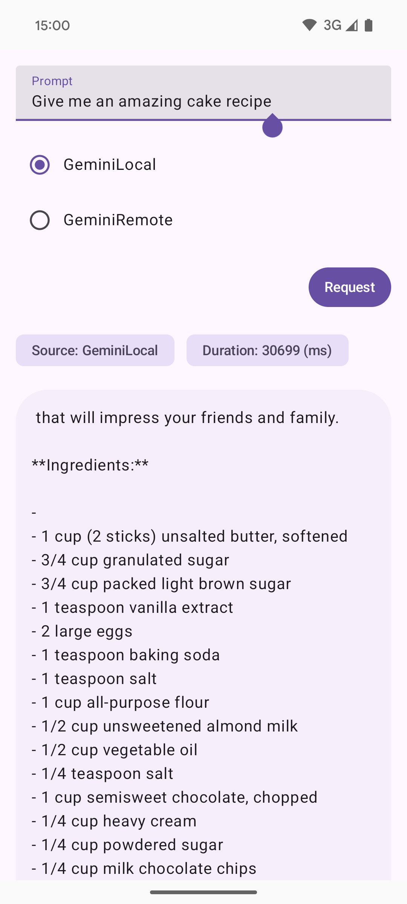

# Android LocalAI

Android LocalAI is an Android application that allows you to use generative AI models locally or remotely via APIs. This project is designed to be flexible, secure, and easy to configure.

## Main Features
- Use generative AI models locally (Edge AI) or via remote services (Google Generative AI API)
  This project uses the following libraries:
- **Google Generative AI** (`com.google.ai.client.generativeai`)
- **Google AI Core (Edge AI)** (`com.google.ai.edge.aicore`)


 <video src="demo.mp4" width="180"/>

## Other included features
- Modern user interface based on Jetpack Compose and Material 3
- Dependency injection with Koin
- Modular and testable architecture

## Main Dependencies
- **Jetpack Compose** (Modern UI)
- **Material 3** (Material Design)
- **Koin** (Dependency Injection)
- **AndroidX** (core-ktx, lifecycle, activity-compose, etc.)
- **JUnit & Espresso** (Testing)

## Prerequisites
- **Android Studio** (Giraffe or newer recommended)
- **JDK 17+**
- **Internet connection** on the device, for remote usage

## Local Usage Configuration
To use Gemini Nano locally (Edge AI):
1. Make sure your device supports Google AI Core. More information can be found in the [Google AI Core documentation](https://developer.android.com/ai/gemini-nano).
2. *No API key is required for local execution.*
3. Install the app on a compatible device.

## Remote Usage Configuration (Google Generative AI API)
1. Go to Google AI Studio ([here](https://makersuite.google.com/) or [here](https://aistudio.google.com/apikey)) to obtain an API key.
2. Add the API key in build config field in `build.gradle.kts`:
   ```kotlin
    buildConfigField(
        "String",
        "GEMINI_API_KEY",
        "\"<YOUR_KEY_HERE>\""
    )
    ```
3. The project will automatically read this key at runtime.

**Note:** Ensure that your API key is kept secure and not hard-coded in the source code. This method isn't secured.

## Best Practices
- Never share your API key publicly or an APK with the remote Key to anyone.
- Use environment variables or `local.properties` for secrets.

## Useful Resources
- [Official Google Generative AI Documentation](https://ai.google.dev/)
- [Jetpack Compose](https://developer.android.com/jetpack/compose)
- [Koin](https://insert-koin.io/)

## License
This project is licensed under the MIT License. See the LICENSE file for more information.